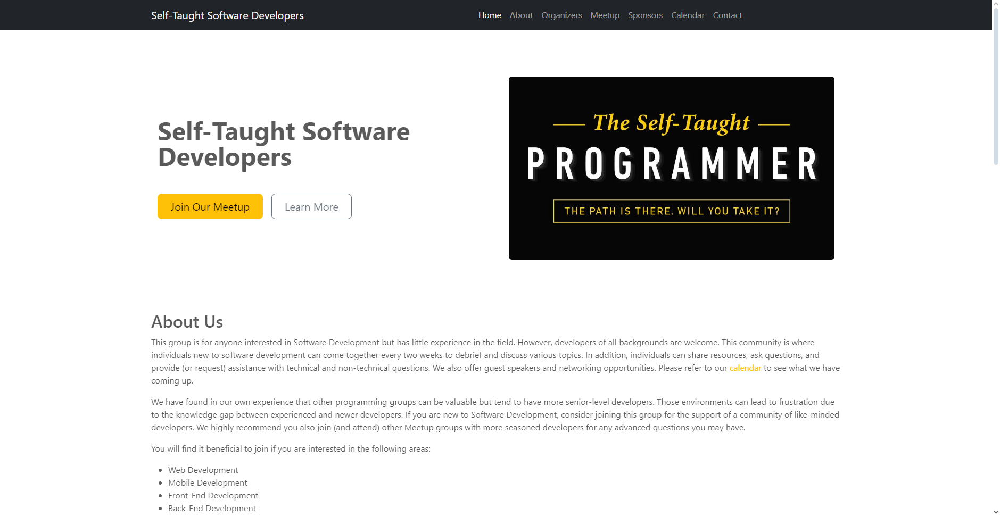

<h1 style="text-align: center;"> Self-Taught Software Developers</h1>

<h2 style="text-align: center;"> Description </h2>

This is a website dedicated to our group, Self Taught Software Developers. It is an open source website created by our own members. 
 
 
This group is for anyone interested in Software Development but has little experience in the field. However, developers of all backgrounds are welcome. This community is where individuals new to software development can come together every two weeks to debrief and discuss various topics. In addition, individuals can share resources, ask questions, and provide (or request) assistance with technical and non-technical questions. We also offer guest speakers and networking opportunities. Please refer to our calendar to see what we have coming up. 

## Screenshot

## Contributing

This application is open-source. To contribute to this application, fork our repo and take a look at the issues posted in our issues tab.

## Link

Visit our site today:
 
https://selftaughtdevelopers.org/

 
